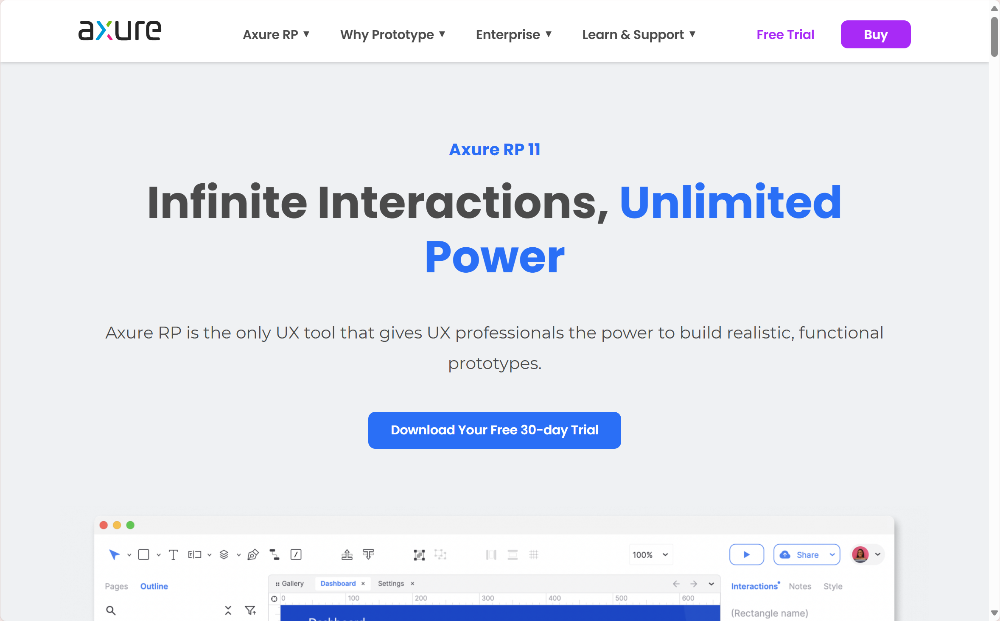

# 个人作业2：Web前端设计

## 一、作业要求：

- 使用**Axure**等软件设计某个页面

- 为团队选取一个前台及后台模板

## 二、Axure进行页面设计

### 2.1、Axure RP11下载

进入axure官网：https://www.axure.com/，点击`Download Your Free 30-day Trail`，可以获得Axure免费的30天试用，下载后直接进行下载即可。

         
    

### 2.2、页面框架搭建

在本次网页搭建中，我们主要采取以下框架：

即网页整体包括进入主页面`Starters overview`以及四个分页面`sleeping page``working page``studying page``friending page`

本框架有以下几部分组成：

1. `Starters overview`：为几个子页面的进入主页面
2. 分页面：由`Starters overview`跳转而来，一共有以下四个吗，每种页面实现了不同的网页效果：
   - `sleeping`：介绍本人的睡眠安排方面，主要实现了点击-变换文本效果
   - `studying`：介绍本人的学习安排方面，主要实现了点击-出现/隐藏组件效果
   - `working`：介绍本人的睡眠安排方面，主要实现了下拉选项框效果
   - `friending`：介绍本人的睡眠安排方面，主要实现了拖动数值bar的动态显示效果

### 2.3、页面设计

1. Auxre基本功能（文本，图形编辑变换，组件，图层功能）：

   以`Starters overview`页面制作过程为例：

   - 文本编辑：包括字体风格、大小、颜色、加粗等；
   - 图形编辑：包括对图形进行等比放大缩小，位置、圆角调整等；
   - 分组功能：将多个组件进行Grouping操作，方便操作，分组可在左侧工具栏查看详情。

2. Auxre页面跳转：

  选中组件后，点击右侧工具栏中`interactions`交互功能实现，最后点击`New interaction`按钮，选中点击事件后的链接跳转设置，此时只需要选择所想要跳转的界面即可。
  
   

3. Axure 组件点击事件设置：

   与页面跳转功能实现过程类似，我们只需在设置事件条件分支（点击事件）后设置我们想要的动画效果：
   例如文本变换，组件的出现、隐藏等，我们以`sleeping page`与`studying page`进行说明：
   
   - `sleeping page`：
     该页面主要实现了文本变化效果，具体操作与页面跳转设置过程类似，在选择点击事件后，触发事件选择`set text`即可：
   - `studying page`：
     该页面主要实现了组件的出现、隐藏效果，在选择点击事件后，触发事件选择Toggle并分别设置出现、消失效果（动画效果，延时设置等）即可：
     

4. 借助 Axure 提供的组件实现复杂功能：

   Axure 内提供了许多不同功能的按钮以及图标模版，其内部自动封装了相应的动画效果，对这些现成的按钮我们可以直接使用。
   我们以`friending page``studying page`与`working page`进行说明：
   
   - `friending page`：
     选取了`Slider continuous`的组件。
   - `studying page`：
     选取了饼状图表组件。
   - `working page`：
     选取了`Split`组件。实现了下拉选项框功能。
   

7. 页面展示：
   

   

### 2.4、功能总结

* 利用Axure中的小部件完成了页面基本布局的设计

* 实现了利用组件进行页面的跳转

* 利用已有的提供组件来完成稍复杂的功能

## 三、前台以及后台模版的挑选

在选择前台和后台模板时，要根据项目需求、用户体验、功能要求等因素来评估和筛选。我这次选取只是为团队提供一个参考的依据。

### 1. 后台模板的选择要点

后台模板的选择主要考虑系统的可扩展性、开发效率、稳定性、安全性以及后期维护的便利性。以下是重点考量的维度：

#### 1.1 开发效率和代码质量
- **代码规范与结构**：
  - 选择代码结构清晰、模块化、组件化的模板，以提高后期的开发效率和可维护性。符合现代开发标准的模板能大大提升代码的可读性和可扩展性。
  - 模板应使用现代前端构建工具（如Webpack、Parcel等），支持模块化开发，确保后期开发和维护的顺畅。
  
- **易于集成与扩展**：
  - 模板应支持常见的第三方库和工具的集成（如文件上传、数据可视化插件、富文本编辑器等），减少开发时对外部库兼容性问题的担忧。
  - 后台模板应有灵活的接口和扩展机制，方便后期根据业务需求添加功能和模块，避免系统功能出现瓶颈。

#### 1.2 安全性和稳定性
- **用户权限管理**：
  后台系统通常涉及大量敏感数据，因此用户权限管理是首要考虑的安全性要素。一个良好的权限管理功能可以让不同角色的用户访问不同的功能和数据，确保系统的安全性。
  
- **数据保护与备份**：
  后台模板应内置防止SQL注入、XSS攻击等常见的安全漏洞的机制，同时支持数据备份与恢复功能，保障系统运行时的数据安全。
  
#### 1.3 可维护性与技术支持
- **技术文档与社区支持**：
  一个有详细文档和活跃社区支持的模板能有效减少开发过程中的困难，尤其在项目后期扩展时，技术文档能提供及时的支持。
  
- **后期维护性**：
  随着项目功能扩展，后台系统的需求可能会增加。模板应该支持模块化设计，易于修改和扩展，这样可以减少后期维护的成本。
---

### 2. 前台模板的选择要点

前台模板的选择侧重于用户体验、视觉效果、加载速度和性能优化等方面。以下是关键的选择维度：

#### 2.1 用户体验和界面交互
- **交互性设计**：
  前台模板的交互设计应简洁、直观，易于操作。尤其是对于搜索、表单、购物车等频繁操作的功能，模板应提供清晰的反馈（如按钮状态、进度条等）来增强用户体验。
  
- **动态效果与动画**：
  适当的动态效果可以提升界面的吸引力，但要避免过于复杂的动画。模板应保持动画的简洁，避免影响页面的加载速度和用户操作的流畅性。

#### 2.2 可定制性与灵活性
- **定制能力**：
  模板应具备高度的可定制性，允许修改CSS、HTML和JavaScript等，以便根据项目需求进行调整，满足不同品牌或用户需求。
  
- **主题切换与多语言支持**：
  如果项目需要支持多语言或不同主题，模板应具备良好的国际化（i18n）支持和易于切换的主题机制，以便更好地适应不同地区的用户。

#### 2.3 性能优化与加载速度
- **优化资源加载**：
  选择一个优化良好的模板，支持资源异步加载、懒加载等技术，减少不必要的外部依赖，确保页面在不同设备上都能快速加载。
  
- **SEO友好性**：
  模板应具有良好的SEO优化，结构清晰，标签使用规范，能有效提高网站的搜索引擎排名。

#### 2.4 跨平台兼容性
- **多设备兼容性**：
  前台模板应支持响应式设计，确保页面在各种设备（如手机、平板、桌面等）上都能正确显示，尤其是在移动端的表现更为重要。
  
- **浏览器兼容性**：
  模板应支持主流浏览器（如Chrome、Firefox、Safari等）的兼容性，保证不同浏览器中显示的一致性。

---

