# 个人作业3：开源建站工具初试文档

## 一、作业要求：

- 自行安装WordPress并随意安装模块、设计布局。

- 记录安装步骤及最终页面
  
  ---

## 安装 WordPress 步骤

### 1 安装 XAMPP
   XAMPP是一个跨平台的集成开发环境，包含了Apache、MySQL、PHP和Perl等服务，适用于在本地搭建开发与测试环境。安装和配置XAMPP是使用WordPress的第一步。

1. **下载并安装XAMPP**
   - 从[XAMPP官方网站](https://www.apachefriends.org/index.html)下载并安装XAMPP，选择适合自己操作系统的版本。（因为在报告完成前 XAMPP 已经安装，在这里安装截图不再给出）
     
     

         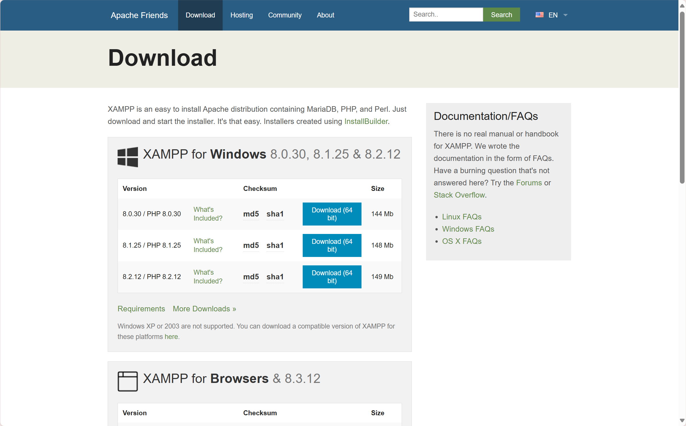
         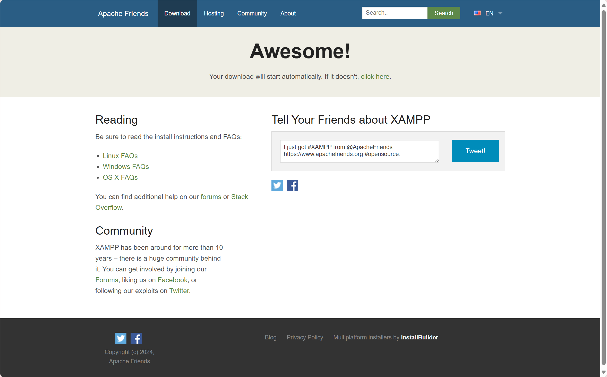
    

   
2. **启动XAMPP并检查服务**
   - 打开XAMPP控制面板，启动Apache和MySQL服务。确保它们正常运行，可以通过`http://localhost/`访问Apache服务。
     
    

         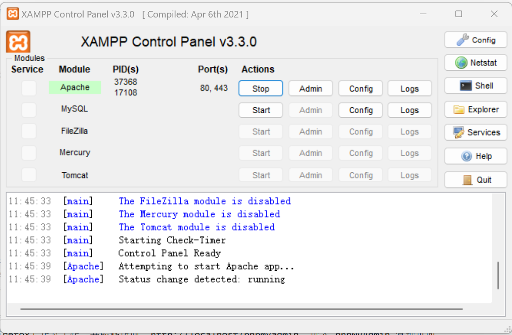
    

### 2.下载并安装WordPress

1. **下载WordPress**
   - 访问[WordPress官网](https://cn.wordpress.org/download/)，下载最新版本的WordPress压缩包。
     
 

         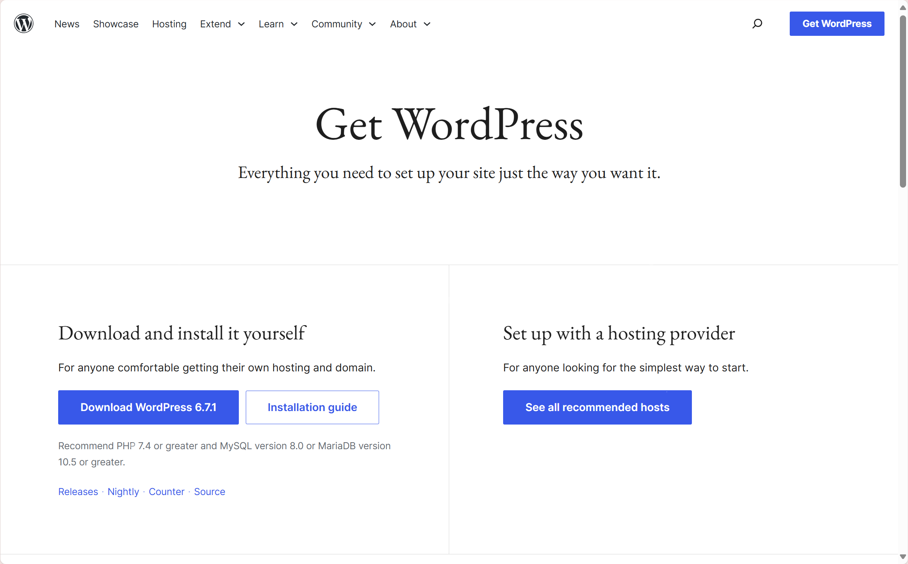
    

2. **解压并移动文件**
   - 解压下载的WordPress文件，将解压后的文件夹重命名为`wordpress`，并将其放入XAMPP的`htdocs`文件夹中。
     

         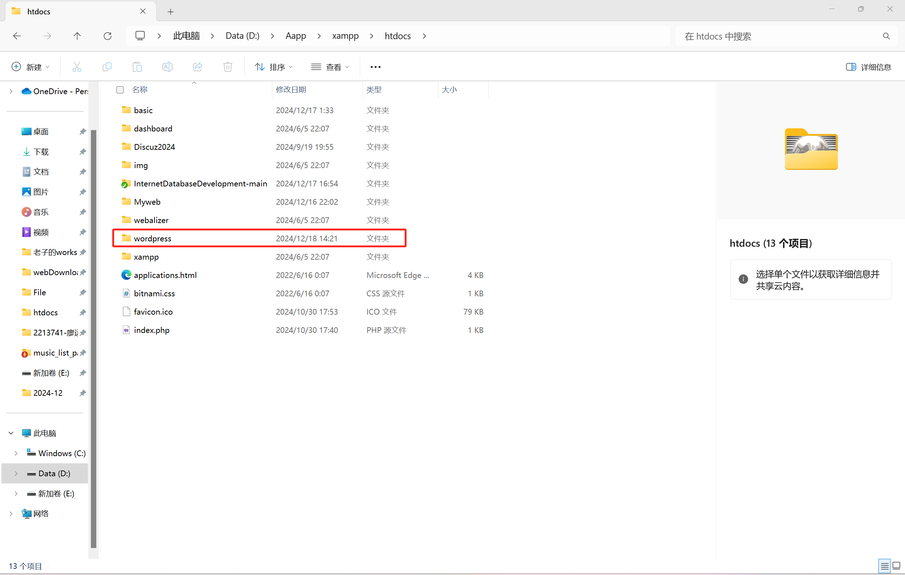
    

3. **配置数据库**
   -  在本地数据库创建一个新的数据库（命名为`wordpress_db`）我们在这里借助 Navicat 进行数据库建立。此数据库将用于存储WordPress的数据。
     
    

         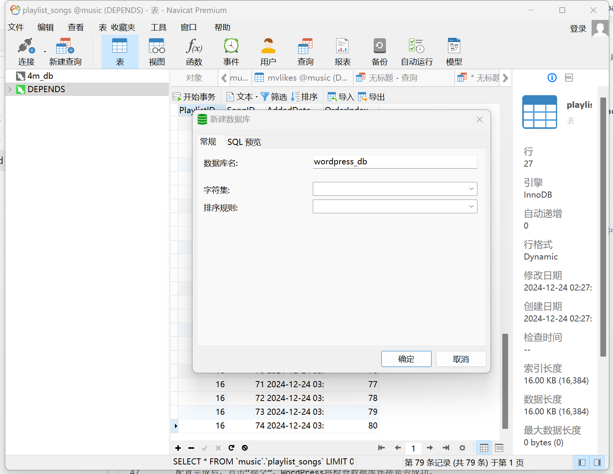
    

### 3. 配置WordPress

1. **访问WordPress安装页面**
   - 在浏览器中输入`http://localhost/wordpress`，进入WordPress的安装页面。
   
2. **配置数据库连接**
   - 在安装页面上，WordPress会提示输入数据库的信息：
     - 数据库名：`wordpress_db`（你在phpMyAdmin中创建的数据库名）
     - 数据库用户名：`root`（默认用户名）
     - 数据库密码：`（根据你的设置）`（如果是默认安装，通常为空）
     - 数据库主机：`localhost`，端口：`3306`（或你修改的端口）
     - 表前缀：`wp_`（保持默认即可）

   配置完成后，点击“提交”，WordPress将检查数据库连接是否成功。

4. **安装WordPress**
(由于之前已经安装过，在这里无法提供类似页面截图)
   - 如果数据库连接成功，点击“运行安装”按钮，WordPress将进入安装页面。
   - 填写站点标题、管理员用户名、密码以及电子邮件地址等信息。
   - 完成设置后，点击“安装WordPress”按钮。

6. **登录到后台**
   - 安装完成后，点击“登录”进入WordPress后台。输入刚才设置的用户名和密码，即可访问WordPress的管理界面。
     
    

         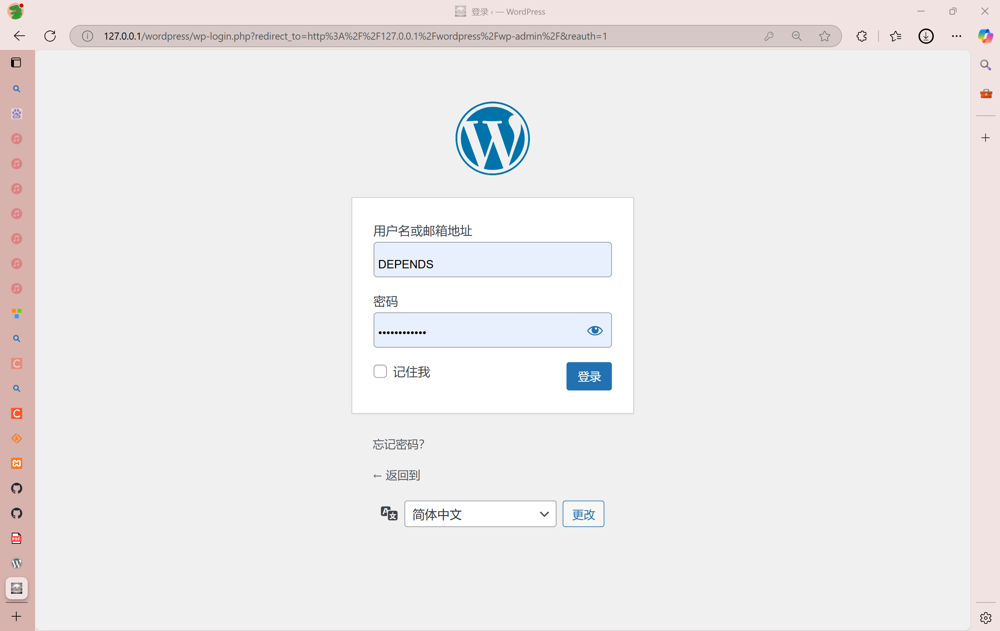
         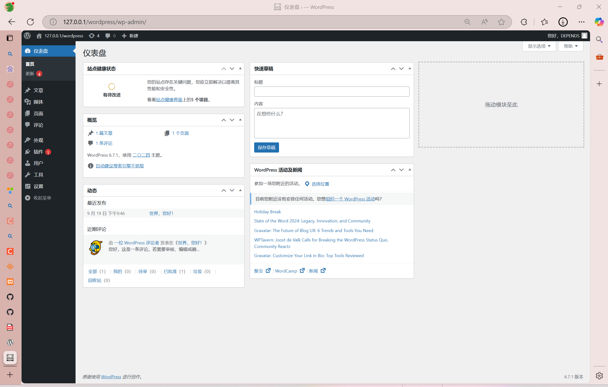
    

    
  - 登录成功后进入到主页面，我们可以到wp_admin页面中管理我们自己的wordpress页面，下面将接受如何利用安装的插件制作一个简易的个人页面。
    

---

## 使用 Elementor 插件设计页面布局

### 一、安装 Elementor 插件

1. 在后台左侧菜单栏，点击 **插件** > **安装插件**。
2. 在插件页面的右上角搜索框中输入“Elementor”。
3. 在搜索结果中找到 **Elementor Website Builder**，点击 **现在安装** 按钮。

   

         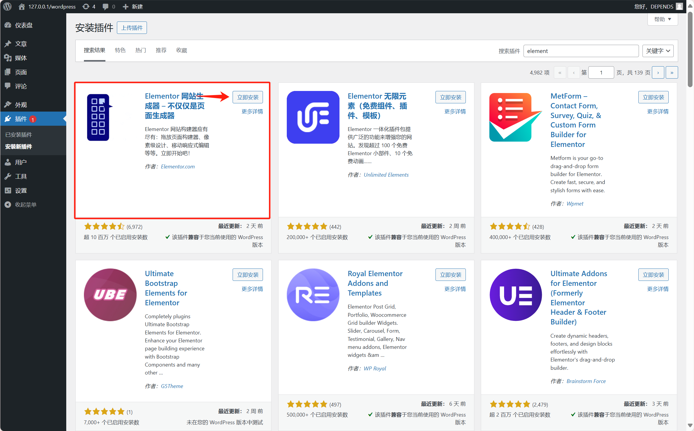
    

4. 安装完成后，点击 **启用** 按钮，启用 Elementor 插件。

---

### 二、使用 Elementor 设计页面布局

1. 在 Elementor 编辑界面，会看到一个实时预览的页面，以及左侧的控件面板，里面有各种组件（如文本框、图片、按钮等）。
   
   

         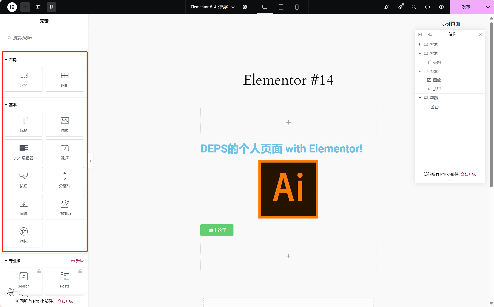
    

    
2. **添加文本**
   - 在左侧面板中找到 **文本编辑器** 组件，拖动到页面的合适位置，输入你想要显示的内容。
   -  当然在输入文本后， Elementor也提供对于输入文字的风格调整，我们可以在选中编辑文本后，在左侧的样式框中调整文字的不同风格（包括字体系列、字体大小、字体颜色等）
   

         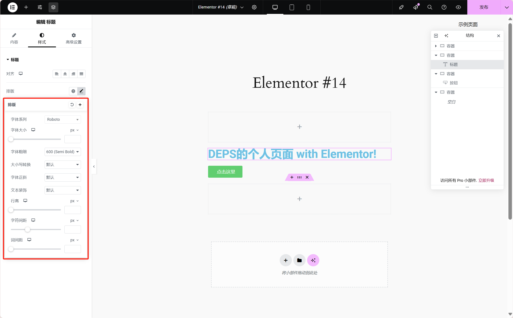
    

  
3. **添加图片**：
   - 找到 **图片** 组件，拖动到页面，点击选择或上传图片。
   - 当然在上传图片后， Elementor也提供对于图片显示的调整，我们可以在选中插入图片后，同样也是在在左侧的样式框中调整图片显示参数（包括大小，透明度，滤镜等）
  

         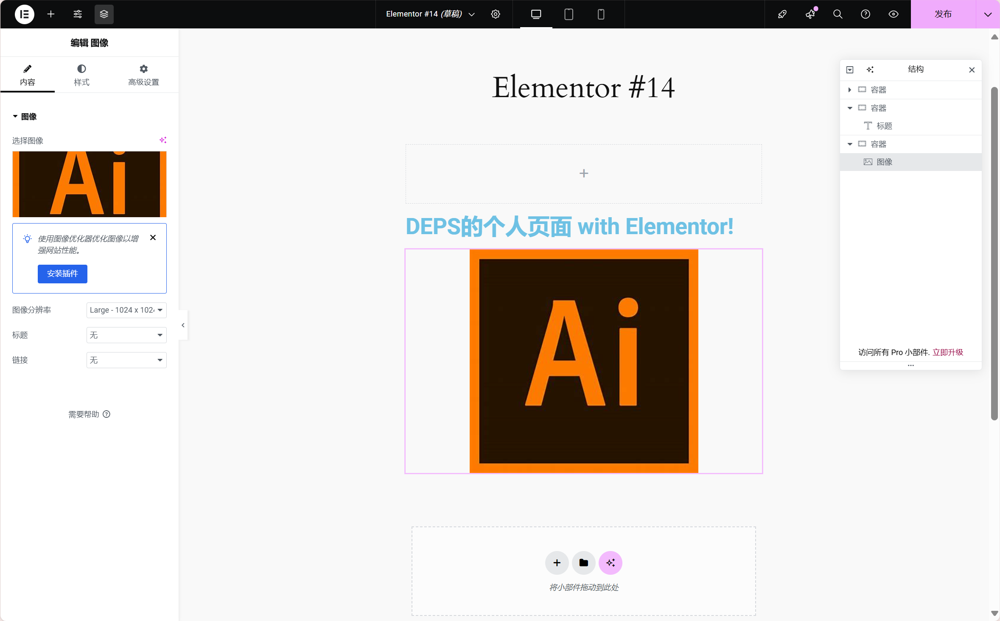
    

   
4. **添加按钮**：
   - 拖动 **按钮** 组件，设置按钮文字和链接地址，设置按钮样式。
   - 按钮的跳转功能也可以在左侧工具栏进行设置，在这里跳转链接被设置为`#`之后演示时可以看到按钮的跳转功能
  
       

         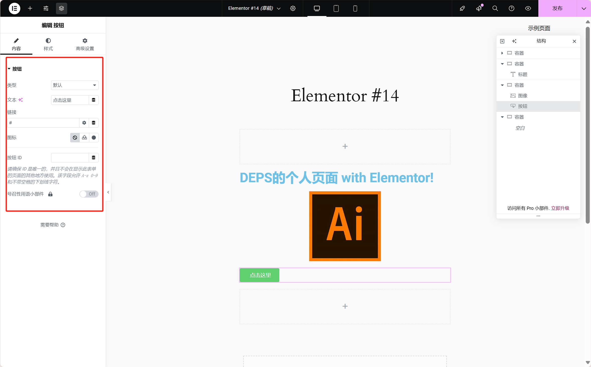
    

5. **保存和发布页面**

    - 在设计完成后，点击右下角的 **发布** 按钮，将设计的页面发布到网站。
    - 同时设置我们的主显示界面为我们刚刚制作的界面`Elementor #14`
    - 设置完毕后我们能够访问我们wordpress主连接，即可查看制作的页面：
  

             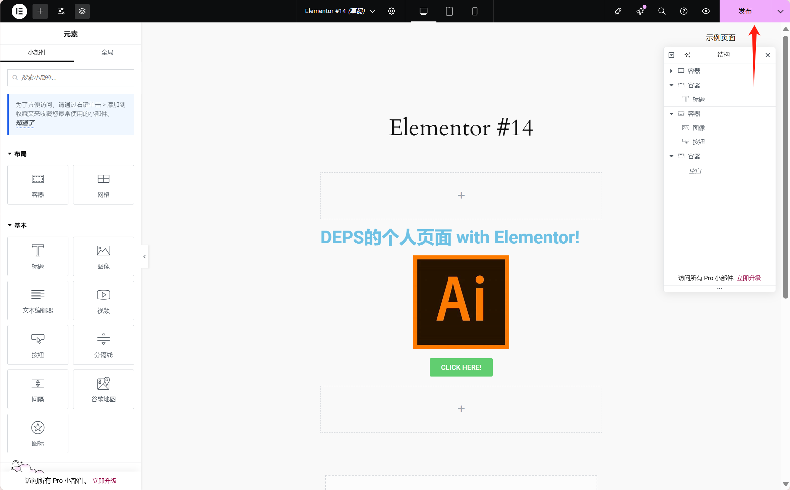
         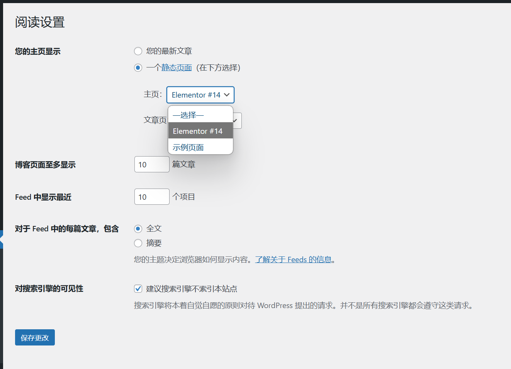
         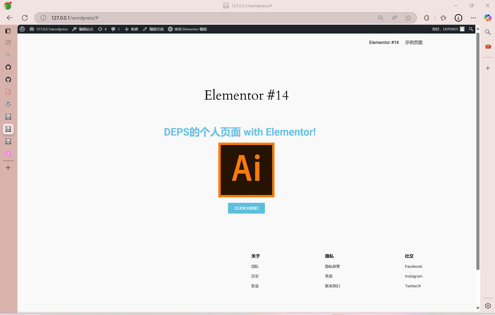
    

---

